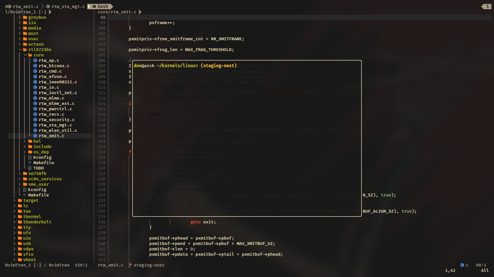

# Neovim Lua Configuration

A modern, fast, and sleek Neovim Lua setup. 
Featuring a refined Gruvbox Material aesthetic.

## Highlights

* **Performance First**: Leveraging lazy.nvim for fast startup and blink.cmp for high-performance completion.
* **C/Systems Focus**: Tailored clangd configuration with smart root directory detection (looks for compile_commands.json, .git, etc.).
* **Streamlined UI**: 
    * **Lualine Integration**: Advanced statusline, tabline (for buffers), and winbar (for path context).
    * **Custom Aesthetics**: Clean end-of-buffer looks and indent-blankline (ibl) for deep code structure visualization.
* **Productivity Tools**: Telescope for fuzzy finding, NvimTree for file management, and ToggleTerm for seamless terminal access.

## Key Bindings

The leader key is set to Space.

| Mapping | Action |
| :--- | :--- |
| <leader>w / ww | Save / Save and Quit |
| <leader>ff / fg | Find Files / Live Grep (Telescope) |
| <leader>> / < | Next / Previous Buffer |
| <leader>nc | Toggle NvimTree |
| <leader>ft | Toggle Floating Terminal |
| <c-h/j/k/l> | Quick Window Navigation |

## Plugin Stack

* **Package Manager**: lazy.nvim
* **Completion**: blink.cmp
* **LSP**: nvim-lspconfig
* **Theme**: gruvbox-material
* **Utils**: nvim-autopairs, nvim-surround, gitsigns.nvim, neoscroll.nvim

## Installation

1. Clone this repo to ~/.config/nvim.
2. Open Neovim and let lazy.nvim install the plugins automatically.
3. Ensure clangd is installed in your system for C/C++ support.

